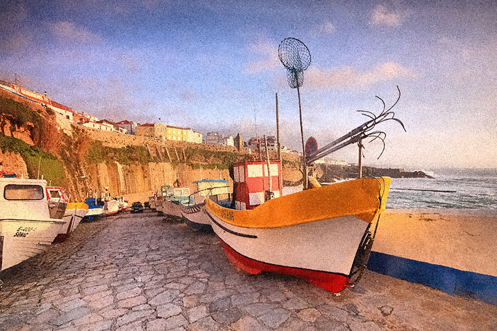

# denoising-metrics_CVC2019
An implementation of CVC2019 paper: Si Lu, "No-reference Image Denoising Quality 
Assessment" (http://web.cecs.pdx.edu/~lusi/denoisingMetrics.html) using MATLAB

## Usage

### Setup

#### Compile
In folder core, run
```
mex srMex.cpp
```
#### Pre-trained model (Too large to uploaded in this repo.)
Visit http://web.cecs.pdx.edu/~lusi/denoisingMetrics.html to download our code 
with complete pre_trained Random Forests models, save them into `models` folder.

### Demo
```
usage: demo
```

### Image Denoising Quality Assessment
```
usage: [score,psnr] = denoisingMetrics(noisyImgName, denoisedImgName, cleanImgName);
input arguments:
    noisyImgName: the name of the noisy image to be denoised
    denoisedImgName: the name of the denoised image to be denoised
    cleanImgName: the name of the corresponding groundtruth clean image
output:
    score: predicted denoising score
    psnr: ground truth PSNR
```

### Image Denoising Quality Feature Computing (single channel input)
```
usage: features = computeFeatures(nImgName, dImgName)
input arguments:
    nImgName: the name of the noisy image to be denoised (single channel input)
    dImgName: the name of the denoised image to be denoised (single channel input)
output:
    features: feature values (1x19 vector) as presented in our paper
```

### Result


<figure>
  
  <figcaption>Optional title</figcaption>
</figure>


<figure>
  
</figure>

<p>
  
  
   
   
   
   
</p>
