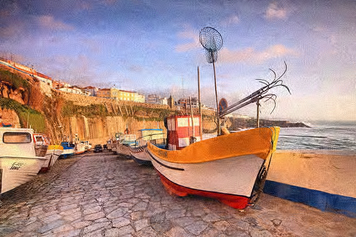

# denoising-metrics_CVC2019
An implementation of CVC2019 paper: Si Lu, "No-reference Image Denoising Quality 
Assessment" (http://web.cecs.pdx.edu/~lusi/denoisingMetrics.html) using MATLAB

## Reference
Si Lu, "No-reference Image Denoising Quality Assessment".
Computer Vision Conference, CVC 2019, Las Vegas.

## License
For academic use only. All rights reserved to the authors of the paper. If you
have any questions, comments or suggestions please contact Si Lu at lusi@pdx.edu
or daniel08220822@gmail.com. Please cite our paper if you use this piece of code.

## Usage

### Setup

#### Compile
In folder core, run
```
mex srMex.cpp
```
#### Pre-trained model (Too large to uploaded in this repo.)
Visit http://web.cecs.pdx.edu/~lusi/denoisingMetrics.html to download our code 
with complete pre_trained Random Forests models, save them into `models` folder.

### Demo
```
usage: demo
```

### Image Denoising Quality Assessment
```
usage: [score,psnr] = denoisingMetrics(noisyImgName, denoisedImgName, cleanImgName);
input arguments:
    noisyImgName: the name of the noisy image to be denoised
    denoisedImgName: the name of the denoised image to be denoised
    cleanImgName: the name of the corresponding groundtruth clean image
output:
    score: predicted denoising score
    psnr: ground truth PSNR
```

### Image Denoising Quality Feature Computing (single channel input)
```
usage: features = computeFeatures(nImgName, dImgName)
input arguments:
    nImgName: the name of the noisy image to be denoised (single channel input)
    dImgName: the name of the denoised image to be denoised (single channel input)
output:
    features: feature values (1x19 vector) as presented in our paper
```

### Result

Ground truth `PSNR` v.s. our predicted denoising metrics score `SCORE`

||
|:--:|
| Clean image |

||
|:--:|
| Noisy image |

||
|:--:|
| Denoised image 1, PSNR=26.164687, SCORE=27.859165 |

||
|:--:|
| Denoised image 2, PSNR=25.118766, SCORE=21.513022 |

||
|:--:|
| Denoised image 3, PSNR=24.654380, SCORE=19.038154 |

||
|:--:|
| Denoised image 4, PSNR=23.342525, SCORE=17.881230 |

